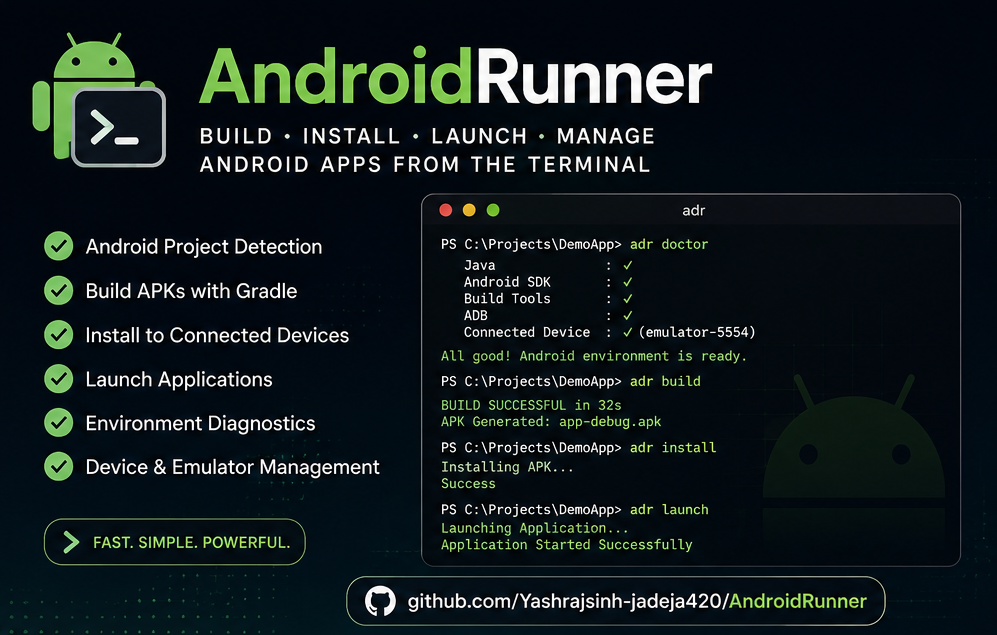

<p align="center">
  
</p>


<h1 align="center">
  AndroidRunner 🚀
</h1>

<p align="center">
  Lightweight Android development workflow automation from your terminal.
</p>


<p align="center">


</p>


---

# 🎬 Demo

<p align="center">
https://github.com/user-attachments/assets/abc1cd79-0328-4980-9c60-2d554cd919ab
</p>


---

# 📖 About

AndroidRunner is a lightweight command-line Android development assistant.

It simplifies common Android workflows by providing a unified CLI for:

- Building APKs
- Installing applications
- Launching apps
- Managing devices
- Debugging with ADB
- Checking development environments


Built with:

- Python
- Gradle
- Android SDK
- ADB


---

# ✨ Features


## 🔨 Build Automation

- ✅ Android project detection
- ✅ Gradle wrapper detection
- ✅ APK building
- ✅ Clean builds
- ✅ Release workflow


## 📱 Device Management

- ✅ Connected device detection
- ✅ APK installation
- ✅ Application launching
- ✅ Emulator management


## 🩺 Developer Diagnostics

- ✅ Java detection
- ✅ Android SDK detection
- ✅ Build Tools verification
- ✅ ADB health checks


## 🛠 Developer Tools

- ✅ Logcat viewer
- ✅ Log filtering
- ✅ Log saving
- ✅ Screenshot support
- ✅ Screen recording


---

# 🚀 Installation


## Clone Repository

```bash
git clone https://github.com/Yashrajsinh-jadeja420/AndroidRunner.git

cd AndroidRunner
```


---

## Create Virtual Environment

```powershell
python -m venv .venv
```


Activate:

### Windows PowerShell

```powershell
.venv\Scripts\Activate.ps1
```


### Windows CMD

```cmd
.venv\Scripts\activate.bat
```


### Linux/macOS

```bash
source .venv/bin/activate
```


---

## Install

```powershell
pip install -e .
```


---

# ⚡ Quick Start


Check your Android setup:

```powershell
adr doctor
```


Example:

```
✓ Java detected
✓ Android SDK detected
✓ Build Tools detected
✓ ADB connected
```


---

# 📱 Commands


## Check Devices

```powershell
adr devices
```


## Build APK

```powershell
adr build
```


## Install APK

```powershell
adr install
```


## Launch Application

```powershell
adr launch
```


## View Logs

```powershell
adr logs
```


## Emulator Management

```powershell
adr emulator
```


## Complete Workflow

```powershell
adr run
```


Runs:

```
Build APK
      ↓
Install APK
      ↓
Launch Application
```


Example:

```
$ adr run


AndroidRunner Run


[1/3] Building APK

BUILD SUCCESSFUL


[2/3] Installing APK

APK Installed Successfully


[3/3] Launching Application

Application started successfully.
```


---

# 🛠 Requirements


Required:

- Python 3.10+
- Java JDK 17+
- Android SDK
- Android Build Tools
- Android Platform Tools (ADB)


---

# 💻 Platform Support


Currently tested:

✅ Windows


Planned:

- Linux
- macOS


---

# 📁 Project Structure


```
AndroidRunner/
│
├── src/
│   └── androidrunner/
│       ├── commands/
│       ├── core/
│       ├── android/
│       └── utils/
│
├── assets/
│   ├── banner.png
│   └── AndroidRunnerTrailer.mp4
│
├── README.md
├── CHANGELOG.md
├── LICENSE
└── pyproject.toml
```


---

# 🤝 Contributing


Contributions, bug reports, and feature requests are welcome.

Feel free to open an issue or submit a pull request.


---

# 📄 Changelog

See:

[CHANGELOG.md](CHANGELOG.md)


---

# 📜 License


Licensed under the MIT License.
